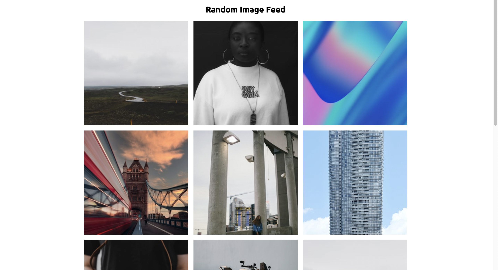

# Random Image Feed

## project notes

1. HTML

- h2 Random Image Feed

2. CSS

3. JavaScript

- 5 rows \* 3 columns
- images from https://source.unsplash.com/random/300x300?sig=
- Math.random()

---

Challenge from Brad Traversy & Florin Pop on Udemy '50 Projects in 50 Days'

---

## Takeaways from the instructor
